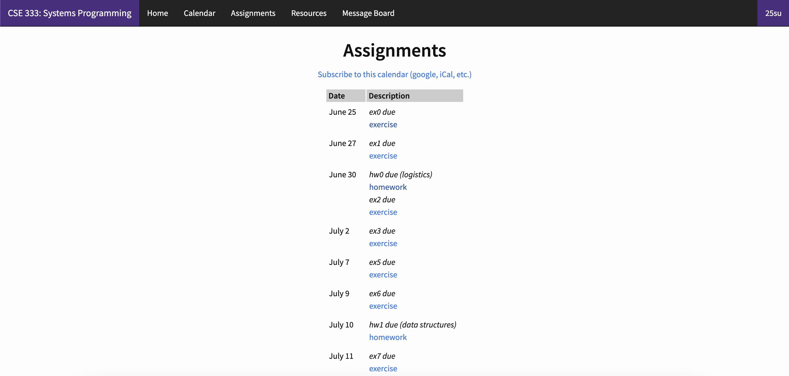
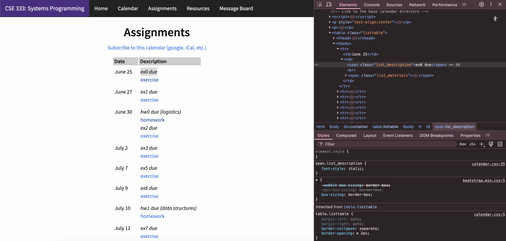

# UW CSE Assignment Reminder
This program periodically checks a given CSE course's website for new assignments, 
and creates a reminder in the Reminders app. This currently only supports MacOS.
It was created in response to the high volume of excercises in CSE 333, which I found
to be helpful. To get started, see the [setup instructions](#1-setup) below.

## 1. Setup

To begin setup, ensure that all files from this repo are saved locally. Next, follow the
instructions in the ```-- Setup --``` section of ```uw-cse-assignment-reminder.py```. You
may need to revisit the sections below during setup.

## 2. Troubleshooting HTML Parsing

The code is currently set up for the CSE 333 25su webpage, but can be easily modified to
work for other CSE courses. Here are the instructions to do so, using 333's site as an
example.

The CSE 333 assignments page looks like this.

All that needs to be done is locating the HTML tags of the elements that contain assignment
information. The easier way to do this is to open your web browser's developer tools. With
Chrome, we can highlight and inspect the element we want to look at to directly view its HTML.

From here, we can see the assignment details are located within a ```<table class=listtable>```
element, and each assignment's detail is contained in a ```<tr>``` element. The due date is contained
within a ```<td>``` tag, and the assignemnt name is within a ```<span class="list_desscription">``` tag
within another ```<td>``` tag. Now, we just need to parse the HTML we get for these tags to get their contents.
We can use [```BeautifulSoup```](https://www.crummy.com/software/BeautifulSoup/bs4/doc/) 
to accomplish this. 

First, set ```DEBUG = True``` on line 44 of ```uw-cse-assignment-reminder.py```. 
This will ensure that no reminders will be created when running code at the start. Sometimes what is shown by
BeautifulSoup varies slightly from what is seen in the developer tools, so we first need to confirm the
tags we found are correct. If they differ, go with what BeautifulSoup shows. To do this, uncomment 
```print(soup.prettify())``` from line 128, and run ```uw-cse-assignment-reminder.py```. You may get
errors from the lines below, but all we need is the prettified output. In our case, the output surrounding the table
also has ```<table class="listtable">```, and shows each table element as
```
<tr>
 <td>
  June 25
  <td>
    <span class="list_description">
     ex0 due
    </span>
    <br/>
    <span class="list_materials">
     <a href="../hw/ex00.html">
      exercise
      </a>
    </span>
  </td>
 </td>
</tr>
```
so we can now update the code to reflect this. On line 129, we set
```rows = soup.find('table', {'class': 'listtable'}).find_all('tr')```
This will find the first occurence of a table tag with the class 'listtable', and then find all
'tr' tags within it. The first element of this will be the table header, which we will filter out
later, but examining the second row via ```print(rows[1])``` shows
```
<tr><td>June 25<td>
<span class="list_description">ex0 due</span><br/><span class="list_materials"><a href="../hw/ex00.html">exercise</a></span>
</td></td></tr>
```
To only get table elements (and not headers), we set ```cell = row.find('td')``` on line 136. This will grab the
first occurence of a ```<td>``` tag, which in our case will be
```
<td>June 25<td>
<span class="list_description">ex0 due</span><br/><span class="list_materials"><a href="../hw/ex00.html">exercise</a></span>
</td></td>
```
Printing ```cell.contents``` yields a list of sub-elements
```
['June 25', <td>
<span class="list_description">ex0 due</span><br/><span class="list_materials"><a href="../hw/ex00.html">exercise</a></span>
</td>]
```
To get the date, we can call ```cell.contents[0]```, which is done in line 143. Then, to extract the assignment name text,
we call ```cell.contents[1].find('span').text```.

And there you have it, we have succesfully extracted the assignment details from the HTML! Following a similar process
should work for any other course.

## 3. Multiple Courses

If you are taking multiple CSE courses, all with the EXACT same assignment page structure, the following changed can be made
to accomodate for this. 

Change ```COURSE_URL``` on line 47 to 

```
COURSE_URLS = [
    "https://courses.cs.washington.edu/courses/cse333/25su/calendar/hwlist.html",
    [other course's assignment page],
    ...
]
```
and replace lines 50-52 (now lines 54-56 if you made the changes above) to
```
JSON_FNAMES = [
    "cse333-seen.json",
    "[other course name]-seen.json",
    ...
]
JSON_PATHS = []
for fname in JSON_FNAMES:
  script_dir = os.path.dirname(os.path.abspath(__file__))
  full_path = os.path.join(script_dir, fname)
  JSON_PATHS.append(full_path)
```
Lastly, add the loop ```for i in range(len(COURSE_URLS)):``` at the start of the -- Script -- section,
and change the remaining occurences of ```COURSE_URL``` and ```JSON_PATH``` to ```COURSE_URLS[i]``` and 
```JSON_PATHS[i]``` respectively.

Thanks for reading, and I hope this helps!
